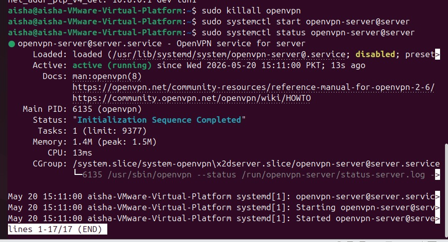
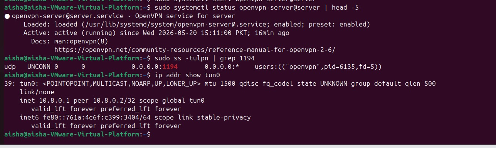
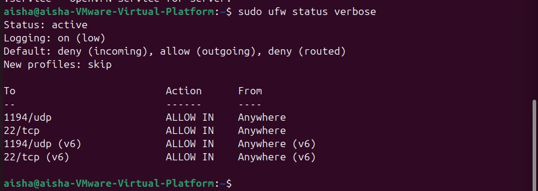
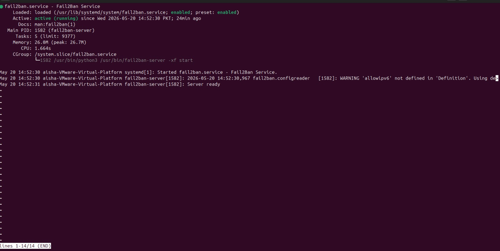
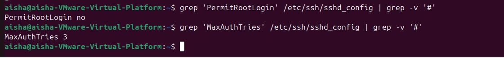
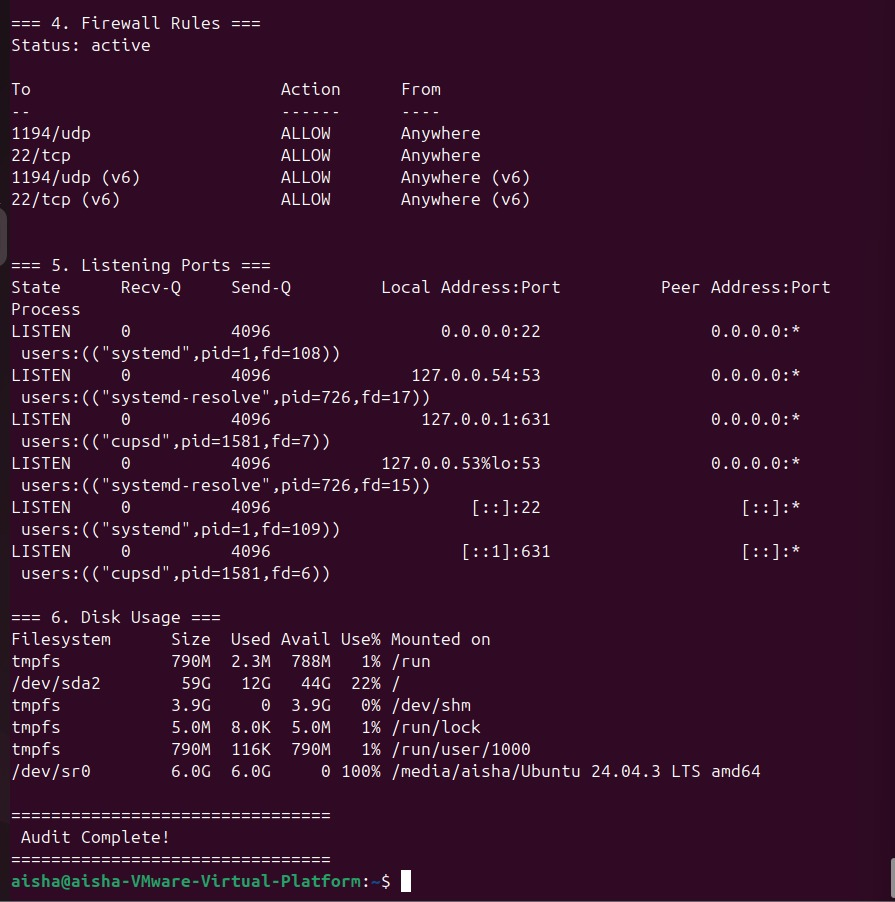

# 🔐 Secure VPN Infrastructure

> Built and deployed a production-style VPN infrastructure on Linux from scratch —
> covering PKI design, encrypted tunnelling, stateful firewall policy, and
> automated security monitoring across all infrastructure layers.

---

## 📋 Overview

Configured a fully operational VPN server on Ubuntu using OpenVPN and a
self-managed PKI. The infrastructure enforces certificate-based mutual
authentication, AES-256 encrypted tunnelling, stateful firewall policies,
and automated intrusion response — built entirely through the Linux terminal
with no GUI tools.

All configuration decisions follow established network security principles
including defence-in-depth, least privilege, and zero implicit trust.

---

## 🏗️ Infrastructure

| Detail | Value |
|--------|-------|
| Host | Windows — VMware Workstation Pro |
| Server OS | Ubuntu 24.04.3 LTS |
| Server IP | 150.1.7.170 |
| VPN Network | 10.8.0.0/24 |
| Lab Network | 150.1.7.0/24 |
| Gateway | 150.1.7.100 |
| VPN Interface | tun0 — 10.8.0.1 |
| Protocol | UDP 1194 |
| Cipher | AES-256-CBC |
| Auth | SHA-256 HMAC |
| Key Exchange | Diffie-Hellman 2048-bit |
| Certificate Authority | FirstGuard-CA — Easy-RSA PKI |

---

## 👥 User Access Control

Principle of Least Privilege enforced across all accounts:

| User | Type | Sudo | Access Level |
|------|------|------|-------------|
| aisha | Superuser | ✅ | Full system administration |
| standarduser | Standard | ❌ | Restricted — no elevated privileges |

---

## 🔒 Security Architecture

**Layer 1 — Encrypted Tunnelling**
All traffic traversing the VPN is encrypted with AES-256-CBC. Connected
clients are assigned addresses from the 10.8.0.0/24 pool and all internet
traffic is routed through the server — rendering passive interception
attacks ineffective regardless of the underlying network.

**Layer 2 — PKI Certificate Authentication**
A private Certificate Authority (FirstGuard-CA) was built using Easy-RSA
to issue and sign certificates for both the server and each client. Mutual
TLS is enforced — a valid signed certificate is required on both sides
before any tunnel is established. Stolen credentials alone cannot grant
access without the corresponding certificate.

**Layer 3 — Stateful Firewall**
UFW configured with a default-deny inbound policy. Only two ports are
explicitly permitted — 22/TCP for SSH administration and 1194/UDP for
OpenVPN. All other inbound connections are silently dropped. IP forwarding
enabled via sysctl to route client traffic through the server to the internet.

**Layer 4 — Intrusion Prevention**
Fail2ban monitors `/var/log/auth.log` continuously. Any source IP
accumulating 3 failed SSH authentication attempts within the monitoring
window is automatically banned for 600 seconds via dynamic firewall rule
injection — closing brute-force as a practical attack vector.

**Layer 5 — SSH Hardening**
SSH daemon reconfigured to disable direct root login and cap authentication
attempts at 3 per session. Combined with Fail2ban, this eliminates both
credential stuffing and privilege escalation via SSH.

---

## 📜 Automation Scripts

Three bash scripts written to automate ongoing system management:

### `scripts/user_manager.sh`
Full user lifecycle management — create and remove accounts, grant and
revoke sudo privileges, enumerate system users, and audit privilege levels
on demand. Eliminates manual error in access control operations.

### `scripts/vpn_monitor.sh`
Real-time VPN health checks — verifies the OpenVPN service state, confirms
the tun0 interface is active, validates port 1194 is bound, reports
connected clients, and provides an on-demand restart capability.

### `scripts/security_audit.sh`
Generates a structured security report covering firewall policy, failed
authentication attempts, active Fail2ban bans, all listening ports, SSH
hardening verification, current user sessions, and disk utilisation.
Designed to run on demand or via scheduled cron job.

---

## 🛠️ Stack

| Category | Technology |
|----------|-----------|
| OS | Ubuntu 24.04.3 LTS |
| VPN | OpenVPN 2.6.x |
| PKI | Easy-RSA 3.x |
| Firewall | UFW |
| IPS | Fail2ban |
| Cipher | AES-256-CBC |
| Key Exchange | Diffie-Hellman 2048-bit |
| Scripting | Bash |
| Virtualisation | VMware Workstation Pro |

---

## 🖥️ Deployment Evidence

All components were built and verified manually through the Linux terminal.
Screenshots below document each layer of the deployment.

---

### OpenVPN Running

OpenVPN service started via systemd and confirmed active with `systemctl
status`. Output shows `active (running)` with `Initialization Sequence
Completed` — the daemon is live, bound to UDP 1194, and ready to
accept client connections.

---

### VPN Tunnel Active

Tunnel interface `tun0` created by OpenVPN on startup and verified with
`ip addr show tun0`. Interface is UP with `inet 10.8.0.1` assigned.
`ss -tulpn` confirms OpenVPN is bound to `0.0.0.0:1194` — encrypted
tunnel is active and routing across `10.8.0.0/24`.

---

### Firewall Active

UFW policy verified with `ufw status verbose`. Default inbound policy
is deny. Only `22/TCP` and `1194/UDP` are explicitly permitted —
all other inbound traffic is silently dropped at the firewall level.

---

### IPS Active

Fail2ban service confirmed `active (running)` and `enabled` on boot.
Monitoring auth logs continuously — any IP failing SSH login 3 times
is automatically banned for 600 seconds via dynamic firewall rule,
making brute-force attacks against this server impractical.

---

### SSH Hardened

`sshd_config` verified post-hardening — `PermitRootLogin no` confirmed,
`MaxAuthTries 3` confirmed. Direct root SSH access is permanently
disabled and session attempts are capped, closing both brute-force
and direct privilege escalation as attack vectors.

---

### Master Proof

`security_audit.sh` executed — producing a structured report covering
firewall rules, open ports, failed login attempts, active sessions,
and disk utilisation in a single run. Output confirms all security
layers are operational simultaneously.

---

## ⚠️ Security Notice

This repository contains no private keys, certificates, or sensitive data.
Config files use placeholder values only. Never commit `.key`, `.crt`,
or `.ovpn` files to a public repository.
